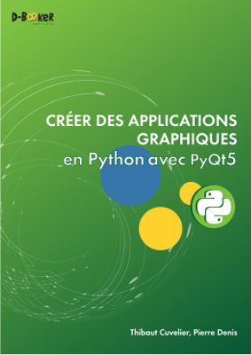

## Créer des applications graphiques en Python avec PyQt 5
Ce dépôt contient les codes sources des exemples du livre [Créer des applications graphiques en Python avec PyQt 5](http://www.d-booker.fr/qt-python/376-creer-des-applications-graphiques-en-python-avec-pyqt.html), prochainement disponible en [version bêta](http://www.d-booker.fr/content/48-version-beta).




Ce livre est écrit par Pierre Denis et Thibaut Cuvelier
et il est publié par les éditions [D-BookeR](http://www.d-booker.fr).

Si ces exemples vous intéressent et que vous n'avez pas acheté le livre, nous vous invitons à le [faire](http://www.d-booker.fr/qt-python/376-creer-des-applications-graphiques-en-python-avec-pyqt.html). Sa rédaction est le fruit d'un gros travail et votre soutien nous sera précieux.

Ces exemples, sauf indication contraire, sont propriété des auteurs.

### Organisation des répertoires
Les exemples sont organisés en répertoires pour chacun des module du livre (qt-widgets et qt-quick). Chaque sous-répertoire feuille contient le code source et les fichiers nécessaires pour exécuter une application, telle que décrite dans une section du livre.

### Prérequis pour l'exécution
Pour pouvoir exécuter ces applications d'exemple, il est nécessaire d'avoir installé [Python 3.5](https://www.python.org/downloads/release/python-350/) (ou supérieur) et [PyQt5](https://www.riverbankcomputing.com/software/pyqt/intro).
Pour plus d'informations, référez-vous à la section 1.4 du livre.

### Lancement d'une application via la console
#### Applications Qt Widget
1. placez-vous dans le répertoire feuille
2. exécutez la commande
```
python start_app.py
```
ou lancez start_app.py via tout autre moyen équivalent (EDI, par exemple). 
#### Applications Qt Quick
1. placez-vous dans le répertoire feuille
2. exécutez la commande
```
qmlviewer main.qml
```
[Un script Python](https://github.com/D-BookeR/GUI_en_Python_avec_PyQt_5/blob/master/qt-quick/7-python/1-qqmlengine/main.py) qui effectue la même opération est disponible dans le dossier [`qt-quick/7-python/1-qqmlengine`](https://github.com/D-BookeR/GUI_en_Python_avec_PyQt_5/tree/master/qt-quick/7-python/1-qqmlengine). Il est détaillé à la section 16.1. 

### Problèmes ?
Si l'application ne démarre pas : 

* vérifiez que Python est bien installé et accessible dans le PATH ; 
* vérifiez que vous lancez la bonne version de Python (si vous en avez plusieurs installées) via la commande
```
python -V
```
* vérifiez que PyQt est bien installé pour la bonne version de Python (si vous en avez plusieurs installées). 
